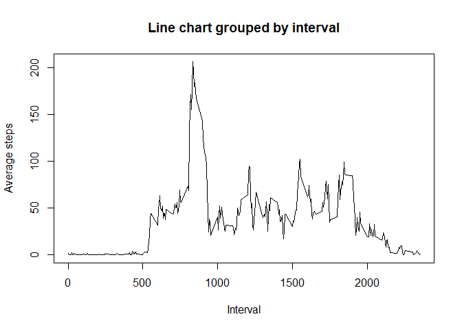

The following code is required to remove warnings from the execution of code chunks

```r
knitr::opts_chunk$set(warning=FALSE)
```

## Loading and preprocessing the data

```r
library(dplyr)
```

```
## 
## Attaching package: 'dplyr'
```

```
## The following objects are masked from 'package:stats':
## 
##     filter, lag
```

```
## The following objects are masked from 'package:base':
## 
##     intersect, setdiff, setequal, union
```

```r
library(ggplot2)
library(data.table)
```

```
## 
## Attaching package: 'data.table'
```

```
## The following objects are masked from 'package:dplyr':
## 
##     between, first, last
```

```r
if(!file.exists('activity.csv')){
  unzip("./activity.zip", exdir='.')
}
data <- read.csv('activity.csv')
data$date <- as.Date(data$date)
summary(data)
```

```
##      steps             date               interval     
##  Min.   :  0.00   Min.   :2012-10-01   Min.   :   0.0  
##  1st Qu.:  0.00   1st Qu.:2012-10-16   1st Qu.: 588.8  
##  Median :  0.00   Median :2012-10-31   Median :1177.5  
##  Mean   : 37.38   Mean   :2012-10-31   Mean   :1177.5  
##  3rd Qu.: 12.00   3rd Qu.:2012-11-15   3rd Qu.:1766.2  
##  Max.   :806.00   Max.   :2012-11-30   Max.   :2355.0  
##  NA's   :2304
```
## What is mean total number of steps taken per day?

```r
groupby <- group_by(data, date)
groupby <- summarise(groupby, total_steps = sum(steps, na.rm = TRUE))
```

```
## `summarise()` ungrouping output (override with `.groups` argument)
```

```r
hist(groupby$total_steps, breaks=20, main="Histogram of total steps per day", xlab="Total Steps")
mean_val <- mean(groupby$total_steps)
median_val <- median(groupby$total_steps)
abline(v=mean_val, lwd=2, col='black')
abline(v=median_val, lwd=2, col='blue')
legend('topright', lwd=3, col=c('black', 'blue'), legend=c(paste("Mean: ", mean_val), paste("Median: ", median_val)))
```

<!-- -->

The mean of total steps per day is 9354.2295082.

The median of total steps per day is 10395.

## What is the average daily activity pattern?

```r
group_by_interval <- group_by(data, interval)
group_by_interval <- summarise(group_by_interval, avg_steps=mean(steps, na.rm = TRUE))
```

```
## `summarise()` ungrouping output (override with `.groups` argument)
```

```r
plot(group_by_interval$interval, group_by_interval$avg_steps, type='l', main="Line chart grouped by interval", xlab="Interval", ylab="Average steps")
```

<!-- -->

```r
max_interval <- group_by_interval[which.max(group_by_interval$avg_steps), "interval"]
```
The interval where maximum number of steps are taken on average is 835.

## Imputing missing values

```r
missing_num <- sum(!complete.cases(data))

data_tmp <- data.table(data)
group_by_interval_tmp <- data.table(group_by_interval)

setkey(data_tmp, interval)
setkey(group_by_interval_tmp, interval)

NA_replace = function(x,y){
    if(is.na(x)){
        
        return(y)
    }
    return(x)
}
dat_tbl_miss = data_tmp[group_by_interval_tmp]
dat_tbl_miss$new_steps = mapply(NA_replace,dat_tbl_miss$steps, dat_tbl_miss$avg_steps)

groupby_tmp <- group_by(dat_tbl_miss, date)
groupby_tmp <- summarise(groupby_tmp, total_steps = sum(new_steps, na.rm = TRUE))
```

```
## `summarise()` ungrouping output (override with `.groups` argument)
```

```r
hist(groupby_tmp$total_steps, breaks=20, main="Histogram of total steps per day", xlab="Total Steps")
mean_val_na <- mean(groupby_tmp$total_steps)
median_val_na <- median(groupby_tmp$total_steps)
abline(v=mean_val_na, lwd=2, col='black')
abline(v=median_val_na, lwd=2, col='blue')
legend('topright', lwd=3, col=c('black', 'blue'), legend=c(paste("Mean: ", mean_val_na), paste("Median: ", median_val_na)))
```

<!-- -->

The mean of total steps per day is 1.0766189\times 10^{4}.

The median of total steps per day is 1.0766189\times 10^{4}.

## Are there differences in activity patterns between weekdays and weekends?

```r
week_class <- function(x){
  if (x %in% c('Saturday', 'Sunday')){
    return('Weekend')
  }
  else{
    return('Weekday')
  }
}
dat_tbl_miss$weekday <- weekdays(dat_tbl_miss$date)
dat_tbl_miss$weekclass <- as.factor(apply(as.matrix(dat_tbl_miss$weekday), 1, week_class))

group_by_interval_class <- group_by(dat_tbl_miss, interval, weekclass)
group_by_interval_class <- summarise(group_by_interval_class, avg_steps=mean(new_steps, na.rm = TRUE))
```

```
## `summarise()` regrouping output by 'interval' (override with `.groups` argument)
```

```r
library(lattice)
xyplot(avg_steps~interval | weekclass, data=group_by_interval_class, type = 'l', xlab = 'Interval', ylab = 'Average Steps', layout = c(1,2))
```

<!-- -->
